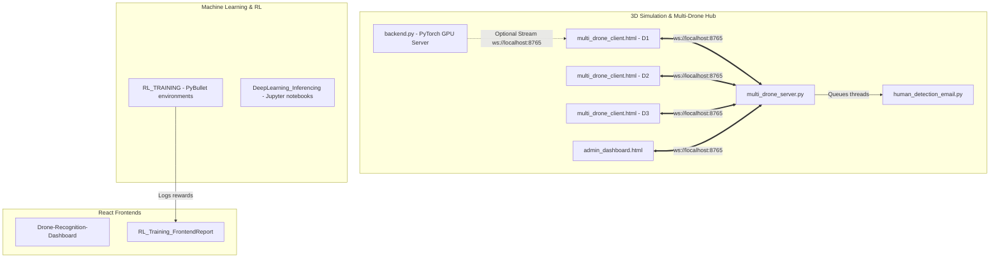

# 🛰️ Mahakumbh distributed Drone Search & Rescue System

This repository hosts a Distributed Search and Rescue (SAR) software suite designed for real-time coordination, autonomous tracking, deep learning analysis, and reinforcement learning optimization of search drones.

---

## 🏗️ System Architecture Overview

The system consists of five main modules working together:

---

## 📦 Detailed Module Breakdowns

### 1. 🌐 3D Simulation & Multi-Drone Hub (`3D-Simulation/`)
This is the core simulation platform built using Three.js, WebGL, and Python WebSockets. It handles the distributed rendering of the physical environment, terrain generation, drone controllers, and real-time multiplayer coordination.

*   **[index.js](file:///home/vaibhi/Dev/35-MAHAKUMBH-46bf24daad4130a9edf4d09570cc2ddf35d8842a/3D-Simulation/index.js)**: The main Three.js client codebase. Dynamically generates hexagonal grid terrain tiles, handles drone models, registers player input (keyboard & touch joysticks), calculates Field of View (FOV) targets, and sends real-time coordinates to the server.
*   **[multi_drone_client.html](file:///home/vaibhi/Dev/35-MAHAKUMBH-46bf24daad4130a9edf4d09570cc2ddf35d8842a/3D-Simulation/multi_drone_client.html)**: The frontend page hosting a single-drone simulation window. It includes a built-in HUD showing coordinates, control modes, network status, and a real-time mini-map showing the positions of all other drones.
*   **[admin_dashboard.html](file:///home/vaibhi/Dev/35-MAHAKUMBH-46bf24daad4130a9edf4d09570cc2ddf35d8842a/3D-Simulation/admin_dashboard.html)**: A centralized control panel for mission commanders. Displays a global real-time 2D grid map with boundaries mapping each drone's assigned region, live battery stats, online status, and logs of found humans.
*   **[multi_drone_server.py](file:///home/vaibhi/Dev/35-MAHAKUMBH-46bf24daad4130a9edf4d09570cc2ddf35d8842a/3D-Simulation/multi_drone_server.py)**: The central synchronization hub. Coordinates distributed client connections, validates region constraints, spawns randomized search targets, evaluates whether a target falls inside a drone's detection radius, and broadcasts state updates to all clients.
*   **[human_detection_email.py](file:///home/vaibhi/Dev/35-MAHAKUMBH-46bf24daad4130a9edf4d09570cc2ddf35d8842a/3D-Simulation/human_detection_email.py)**: Email alert notifier integration. Automatically sends SOS notifications with Google Maps links pointing to the coordinates of the rescued human. Runs on a separate thread to prevent server blocking.
*   **[backend.py](file:///home/vaibhi/Dev/35-MAHAKUMBH-46bf24daad4130a9edf4d09570cc2ddf35d8842a/3D-Simulation/backend.py)**: An alternative PyTorch-powered detection server. Uses YOLO models to process visual/thermal frames and PyTorch CNNs to run spectrogram audio classification, streaming results over WebSockets to client frontends.

---

### 2. 🧠 Reinforcement Learning Simulator (`RL_TRAINING/`)
Contains Python scripts utilizing PyBullet and Stable-Baselines3 (SB3) to train neural network policies for autonomous drone pathfinding.

*   **`singleDroneWithFOV.py`**: Simulates a single drone searching a grid, using raycasting to represent sensor Field of View (FOV) inputs.
*   **`singleDrone_final.py`**: Production training script for single drone search policies.
*   **`fourDrones_final.py`**: Distributed environment simulation where four drones train cooperatively to maximize search coverage while maintaining safety buffers to prevent collisions.

---

### 3. 📊 RL Training Frontend Report (`RL_Training_FrontendReport/`)
A React dashboard dedicated to analyzing reinforcement learning metrics during training cycles.

*   **Key Charts**: Renders live charts showing total rewards, area coverage efficiency, cohesion rewards (keeping drones grouped optimally), and individual drone status.
*   **Primary Technologies**: Built using React, Material UI, Lucide icons, and Recharts.

---

### 4. 🚨 Drone Recognition Dashboard (`Drone-Recognition-Dashboard/`)
An Emergency Response Dashboard built with Vite + React to monitor active camera feeds, thermal scans, and voice-detection alerts.

*   **Key Features**: Allows commanders to swap between active drones (Phoenix-1, Raven-2, Hawk-3), view high-priority detection events, playback audio recordings of crying/screaming alerts, and check confidence ratings.
*   **Visual Assets**: Houses thermal images (`thermal_detected_1.png` - `thermal_detected_4.png`) and camera feeds showing detections.

---

### 5. 🔍 Jupyter Deep Learning Inferencing (`DeepLearning_Inferencing/`)
A folder containing research and evaluation notebooks:
*   **`Deep_Learning_Inferences.ipynb`**: Evaluates custom deep learning models (YOLO and CNNs) against sample visual, thermal, and audio datasets (`test_data/`) to benchmark precision and recall scores.

---

## 📡 Communication Flow & Protocols

Drones communicate with the server using a lightweight JSON-over-WebSocket protocol on port `8765`.

| Client Type | Action | Payload Example |
| :--- | :--- | :--- |
| **Drone** | Register | `{"type": "register", "drone_id": "D1", "client_type": "drone"}` |
| **Drone** | Position Report | `{"type": "pos", "drone_id": "D1", "pos": [140.2, 40.0, -85.5]}` |
| **Admin** | Register | `{"type": "register", "client_type": "admin"}` |
| **Admin** | Request Update | `{"type": "request_update"}` |

### Server Responses
*   **`init`**: Sent immediately on registration. Assigns search boundary limits (`x_from`, `x_to`, `z_from`, `z_to`) and shares target list details.
*   **`positions`**: A broadcast packet sent to all clients containing the active `[x, y, z]` coordinates of every online drone.
*   **`humans_detected`**: Dispatched to the tracking drone and admin panel when a target is marked as discovered.
